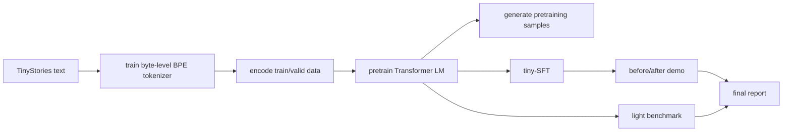

# MiniLLM

This repository hosts the 2026 Summer Semester project for the Program Design and Data Structures course in SJTU's John Class.

The project aims to implement, train, and fine-tune a small Transformer language model.

The project is still being refined. If you find issues in the handout, tests, data preparation, or starter code, please contact me.

## Project Overview

The project starts with a byte-level BPE tokenizer, builds a decoder-only Transformer LM, trains it on TinyStories dataset, and then uses a tiny supervised fine-tuning stage to show a behavior change.

The expected final result is a compact but complete language-modeling pipeline: data, tokenizer, model, training loop, checkpointing, generation, SFT, evaluation, and a light training-performance benchmark.



> What will you learn?

By the end of the project, you will understand:

- how byte-level BPE tokenization maps text to token ids and back;
- how a decoder-only Transformer LM performs next-token prediction;
- how AdamW, learning-rate scheduling, gradient clipping, checkpointing, and evaluation fit into a training loop;
- how TinyStories pretraining changes model generations from random text to story-like text;
- how tiny-SFT can improve response format;
- how to measure and explain basic training performance.

> Project Plan

- **week1**: Build a byte-level BPE tokenizer with GPT2-like pretokenization and the basic neural-network layers.
- **week2**: Build causal attention, the decoder-only Transformer LM, optimizer, schedule, gradient clipping, and checkpointing. (After completing this week's assignment, you are encouraged to explore top-k token generation with the built-in utilities.)
- **week3**: Pretrain your LM on TinyStories, generate samples, and run supervised fine-tuning (SFT).
- **week4**: Evaluate the SFT results, prepare before/after SFT demos, run a light performance benchmark, and write the final report.

> Workload?

The expected student-written core implementation is about 1800-2200 LOC.
Most of that code is in tokenizer, Transformer/model components, optimizer/training utilities, CS336-style batch sampling, SFT response-only data masking, and generation.

Dataset manifest verification, release-data preparation, pretraining data encoding/memmap helpers, full pipeline orchestration, SFT train/eval/report glue, run summaries, and code-usage audit scripts are provided as course infrastructure. You should run and read them, but you are not expected to reimplement them.

> Prerequisites?

Required:
- Curiosity about how a Transformer language model works
- Solid understanding of basic data structures

Helpful but not required:
- Python programming (since python is relatively easy to learn)
- basic use of pytorch tensor (manipulating tensor shape can be annoying)
- basic probability

## Get started

See [Beginer's_Guide.md](docs/Beginer's_Guide.md) to start your trip.

Environment files are provided:

```bash
conda env create -f environment-cpu.yml
# or, on a Linux CUDA machine:
conda env create -f environment-gpu.yml
conda activate cs336-minillm
```

On Apple Silicon, use `environment-cpu.yml`; PyTorch's MPS backend is selected by `--device mps` or by `--device auto` when CUDA is unavailable and MPS is available.

## Scope

MiniLLM trains a teaching-scale model, roughly in the 14M-parameter range.
It is not meant to cover scaling-law experiments, Triton kernel optimization, distributed training, or large-scale SFT.

The implementation should keep the core components from scratch.
You may use `torch.nn.Parameter`, container classes from `torch.nn` such as `Module` and `ModuleList`, and the `torch.optim.Optimizer` base class.
You should not use ready-made layers, functions, or optimizers from `torch.nn`, `torch.nn.functional`, or `torch.optim`.

## References

- [Python Tutorial](https://docs.python.org/3/tutorial/index.html)
- [PyTorch Documentation](https://docs.pytorch.org/docs/stable/index.html)
- [The Illustrated Transformer](https://jalammar.github.io/illustrated-transformer/)
- [TinyStories Dataset](https://huggingface.co/datasets/roneneldan/TinyStories)

Portions of the tests, fixtures, and assignment text are adapted or converted from Stanford CS336 Assignment 1 for course-development/reference purposes. See [THIRD_PARTY_NOTICES.md](THIRD_PARTY_NOTICES.md).

## Future Extensions

Possible future extensions include a stronger tokenizer benchmark, richer SFT data, more mixed-precision experiments, or an optional CUDA/Triton systems track.

## License

MiniLLM code and course-authored materials are released under the [MIT License](LICENSE).

Third-party tests, fixtures, converted assignment text, and datasets retain their own notices and terms. See [THIRD_PARTY_NOTICES.md](THIRD_PARTY_NOTICES.md).
