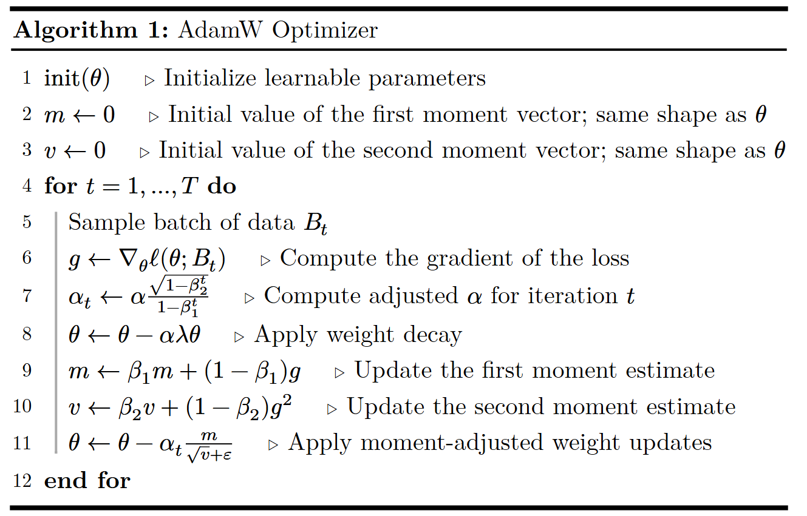

# Training a Transformer LM

We now have the steps to preprocess the data, via the tokenizer, and the model, via the Transformer.
What remains is to build all of the code to support training.
This consists of the following:

- **Loss:** we need to define the loss function (cross-entropy).
- **Optimizer:** we need to define the optimizer to minimize this loss (AdamW).
- **Training loop:** we need all the supporting infrastructure that loads data, saves checkpoints, and manages training.

## Cross-entropy Loss

Recall that the Transformer language model defines a distribution $p_\theta(x_{i+1} \mid x_{1:i})$ for each sequence $x$ of length $m + 1$ and $i = 1, \ldots, m$.
Given a training set $D$ consisting of sequences of length $m + 1$, we define the standard cross-entropy, or negative log-likelihood, loss function:

$$
\ell(\theta; D) =
\frac{1}{|D|m}
\sum_{x \in D}
\sum_{i=1}^{m}
-\log p_\theta(x_{i+1} \mid x_{1:i}).
\qquad (16)
$$

(Note that a single forward pass in the Transformer yields $p_\theta(x_{i+1} \mid x_{1:i})$ for all $i = 1, \ldots, m$.)

In particular, the Transformer computes logits $o_i \in \mathbb{R}^{\text{vocab\_size}}$ for each position $i$, which results in:

$$
p(x_{i+1} \mid x_{1:i})
= \operatorname{softmax}(o_i)[x_{i+1}]
=
\frac{\exp(o_i[x_{i+1}])}
{\sum_{a=1}^{\text{vocab\_size}} \exp(o_i[a])}.
\qquad (17)
$$

The cross-entropy loss is generally defined with respect to the vector of logits $o_i \in \mathbb{R}^{\text{vocab\_size}}$ and target $x_{i+1}$.
Here, $o_i[k]$ refers to the value at index $k$ of the vector $o_i$.

Implementing the cross-entropy loss requires care with numerical issues, just like softmax.

> Your implementation should be in `release/minillm/model/layers.py` (def cross_entropy).


#### Perplexity

Cross-entropy suffices for training, but when evaluating the model, we also want to report perplexity.
For a sequence of length $m$, where we suffer cross-entropy losses $\ell_1, \ldots, \ell_m$:

$$
\operatorname{perplexity}
=
\exp\left(\frac{1}{m}\sum_{i=1}^{m}\ell_i\right).
$$

## The SGD Optimizer

(You are not asked to implement the SGD optimizer, this section is only for illustration.)

Now that we have a loss function, we begin our exploration of optimizers.
The simplest gradient-based optimizer is stochastic gradient descent (SGD).
We start with randomly initialized parameters $\theta_0$.
Then, for each step $t = 0, \ldots, T - 1$, we perform the update:

$$
\theta_{t+1} \leftarrow \theta_t - \alpha_t \nabla L(\theta_t; B_t),
\qquad (19)
$$

where $B_t$ is a random batch of data sampled from the dataset $D$, and the *learning rate* $\alpha_t$ and *batch size* $|B_t|$ are hyperparameters.

### Implementing SGD in PyTorch

To implement optimizers, subclass the PyTorch `torch.optim.Optimizer` class.
An `Optimizer` subclass must implement two methods.

`def __init__(self, params, ...)` should initialize your optimizer.
Here, `params` is a collection of parameters to be optimized, or parameter groups if the user wants different hyperparameters for different parts of the model.
Make sure to pass `params` to the `__init__` method of the base class, which stores these parameters for use in `step`.
You can take additional arguments depending on the optimizer (e.g., the learning rate is a common one), 
and pass them to the base class constructor as a dictionary, where keys are the names (strings) you choose for these parameters.

`def step(self)` should make one parameter update.
During the training loop, this is called after the backward pass, so you have access to gradients from the last batch.
This method should iterate through each parameter tensor `p` and modify it *in place*, i.e. setting `p.data`, which holds the tensor associated with that parameter, based on the gradient `p.grad` (if it exists), 
the tensor representing the gradient of the loss with respect to that parameter.

The PyTorch optimizer API has a few subtleties, so it is easier to explain with an example.
To make the example richer, we implement a slight variation of SGD where the learning rate decays over training, starting with initial learning rate $\alpha$ and taking successively smaller steps:

$$
\theta_{t+1}
=
\theta_t
-
\frac{\alpha}{\sqrt{t+1}}
\nabla L(\theta_t; B_t).
\qquad (20)
$$

Let's see how this version of SGD would be implemented as a PyTorch `Optimizer`:

```python
from collections.abc import Callable, Iterable
from typing import Optional
import torch
import math


class SGD(torch.optim.Optimizer):
    def __init__(self, params, lr=1e-3):
        if lr < 0:
            raise ValueError(f"Invalid learning rate: {lr}")
        defaults = {"lr": lr}
        super().__init__(params, defaults)

    def step(self, closure: Optional[Callable] = None):
        loss = None if closure is None else closure()
        for group in self.param_groups:
            lr = group["lr"]  # Get the learning rate.
            for p in group["params"]:
                if p.grad is None:
                    continue

                state = self.state[p]  # Get state associated with p.
                t = state.get("t", 0)  # Get iteration number from the state, or 0.
                grad = p.grad.data  # Get the gradient of loss with respect to p.
                p.data -= lr / math.sqrt(t + 1) * grad  # Update weight tensor in-place.
                state["t"] = t + 1  # Increment iteration number.

        return loss
```

In `__init__`, we pass parameters and default hyperparameters to the base-class constructor (the parameters might come in groups, each with different hyperparameters).
If the parameters are a single collection of `torch.nn.Parameter` objects, the base constructor creates a single group and assigns it the default hyperparameters.
In `step`, we iterate over each parameter group, then over each parameter in the group, and apply the update above.
Here, the iteration number is stored as state associated with each parameter: we read it, use it in the gradient update, and then update it.
The API specifies that the user may pass in a callable `closure` to re-compute the loss before the optimizer step.
We will not need this for the optimizers used here, but we include it to comply with the API.

To see this working, we can use the following minimal example of a *training loop*:

```python
weights = torch.nn.Parameter(5 * torch.randn((10, 10)))
opt = SGD([weights], lr=1)

for t in range(100):
    opt.zero_grad()  # Reset the gradients for all learnable parameters.
    loss = (weights**2).mean()  # Compute a scalar loss value.
    print(loss.cpu().item())  # Run backward pass, which computes gradients.
    loss.backward()  # Run optimizer step.
    opt.step()
```

This is the typical structure of a training loop.
In each iteration, compute the loss and run an optimizer step.
When training language models, the learnable parameters come from the model, where `m.parameters()` gives this collection.
The loss is computed over a sampled batch of data, but the basic training-loop structure is the same.


## AdamW

Modern language models are typically trained with more sophisticated optimizers, instead of SGD. 
Most optimizers used recently are derivatives of the Adam optimizer [1]. 
We will use AdamW [2], which is in wide use in recent work. 
AdamW proposes a modification to Adam that improves regularization by adding *weight decay* (at each iteration, we pull the parameters towards 0), in a way that is decoupled from the gradient update. 
We will implement AdamW as described in Algorithm 2 of AdamW [2].

AdamW is *stateful*: for each parameter, it keeps track of a running estimate of its first and second moments. 
Thus, AdamW uses additional memory in exchange for improved stability and convergence. 
Besides the learning rate $\alpha$, AdamW has a pair of hyperparameters $(\beta_1, \beta_2)$ that control the updates to the moment estimates, and a weight decay rate $\lambda$. 
Typical applications set $(\beta_1, \beta_2)$ to $(0.9, 0.999)$, but large language models like LLaMA [3] and GPT-3 [4] are often trained with $(0.9, 0.95)$. 
The algorithm can be written as follows, where $\epsilon$ is a small value (e.g., $10^{-8}$) used to improve numerical stability in case we get extremely small values in $v$:

<figure align="center">
  
  <figcaption><b>Algorithm 1:</b> AdamW optimizer pseudocode.</figcaption>
</figure>

Note that $t$ starts at $1$. You will now implement this optimizer.

> Your implementation should be in `release/minillm/train/optim.py` (class AdamW(torch.optim.Optimizer)).


## Learning rate scheduling

The value for the learning rate that leads to the quickest decrease in loss often varies during training. 
In training Transformers, it is typical to use a learning rate *schedule*, where we start with a bigger learning rate, making quicker updates in the beginning, and slowly decay it to a smaller value as the model trains.
(While it’s sometimes common to use a schedule where the learning rate rises back up (restarts) to help get past local minima.)
In this assignment, we will implement the cosine annealing schedule used to train LLaMA [3].

A scheduler is simply a function that takes the current step $t$ and other relevant parameters (such as the initial and final learning rates), and returns the learning rate to use for the gradient update at step $t$. The simplest schedule is the constant function, which will return the same learning rate given any $t$.

The cosine annealing learning rate schedule takes (i) the current iteration $t$, (ii) the maximum learning rate $\alpha_{\max}$, (iii) the minimum (final) learning rate $\alpha_{\min}$, (iv) the number of *warm-up* iterations $T_w$, and (v) the final iteration of cosine annealing $T_c$. The learning rate at iteration $t$ is defined as:

(**Warm-up**) If $t < T_w$, then $\alpha_t = \frac{t}{T_w}\alpha_{\max}$.

(**Cosine annealing**) If $T_w \leq t \leq T_c$, then $\alpha_t = \alpha_{\min} + \frac{1}{2}\left(1 + \cos\left(\frac{t - T_w}{T_c - T_w}\pi\right)\right)(\alpha_{\max} - \alpha_{\min})$.

(**Post-annealing**) If $t > T_c$, then $\alpha_t = \alpha_{\min}$.

Write a function that takes $t$, $\alpha_{\max}$, $\alpha_{\min}$, $T_w$, and $T_c$, and returns the learning rate $\alpha_t$ according to the schedule above.

> Your implementation should be in `release/minillm/train/schedules.py` (def cosine_warmup).


## Gradient clipping

During training, we can sometimes hit training examples that yield large gradients, which can destabilize training. 
To mitigate this, one technique often employed in practice is *gradient clipping*. 
The idea is to enforce a limit on the norm of the gradient after each backward pass before taking an optimizer step.

Given the gradient (for all parameters) $g$, we compute its $\ell_2$-norm $\|g\|_2$. 
If this norm is less than a maximum value $M$, then we leave $g$ as is; 
otherwise, we scale $g$ down by a factor of $\frac{M}{\|g\|_2 + \epsilon}$ (where a small $\epsilon$, like $10^{-6}$, is added for numeric stability). 
Note that the resulting norm will be just under $M$.

Write a function that implements gradient clipping. 
Your function should take a list of parameters and a maximum $\ell_2$-norm. 
It should modify each parameter gradient in place. 
Use $\epsilon = 10^{-6}$ (the PyTorch default). 

> Your implementation should be in `release/minillm/train/optim.py` (def clip_grad_norm_).


## References

[1] Diederik P. Kingma and Jimmy Ba. Adam: A Method for Stochastic Optimization. 2015.

[2] Ilya Loshchilov and Frank Hutter. Decoupled Weight Decay Regularization. 2019.

[3] Hugo Touvron et al. LLaMA: Open and Efficient Foundation Language Models. 2023.

[4] Tom B. Brown et al. Language Models are Few-Shot Learners. 2020.
