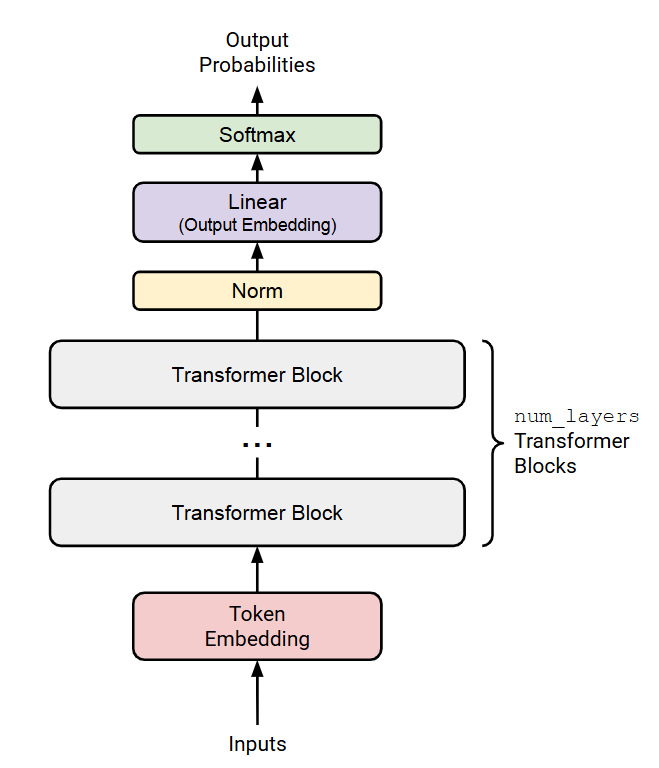
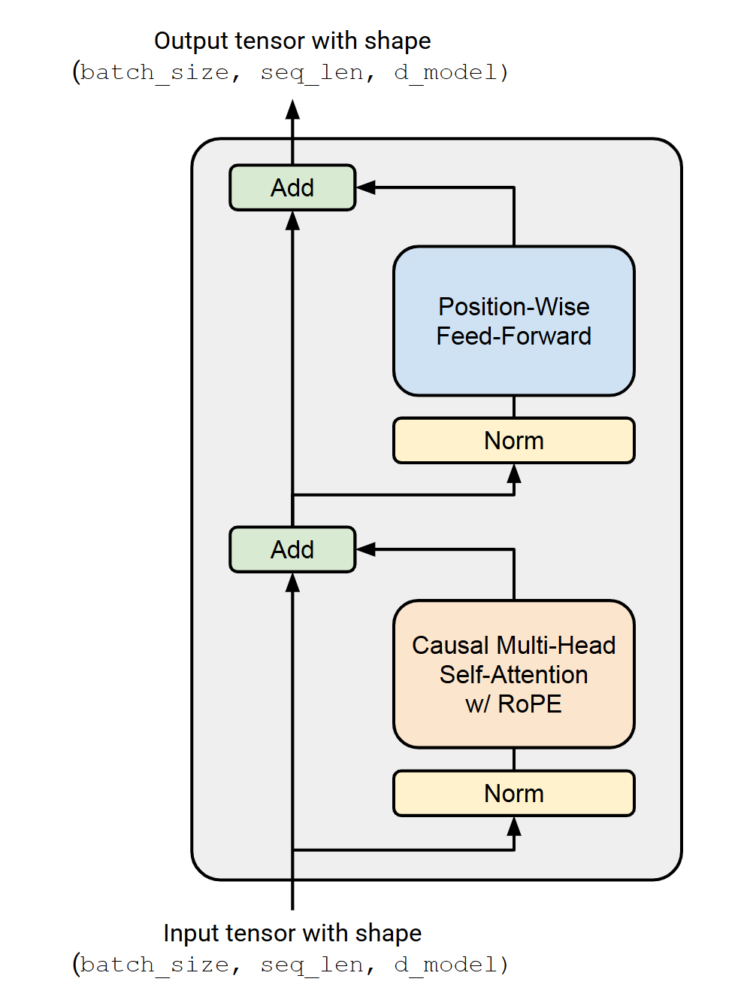
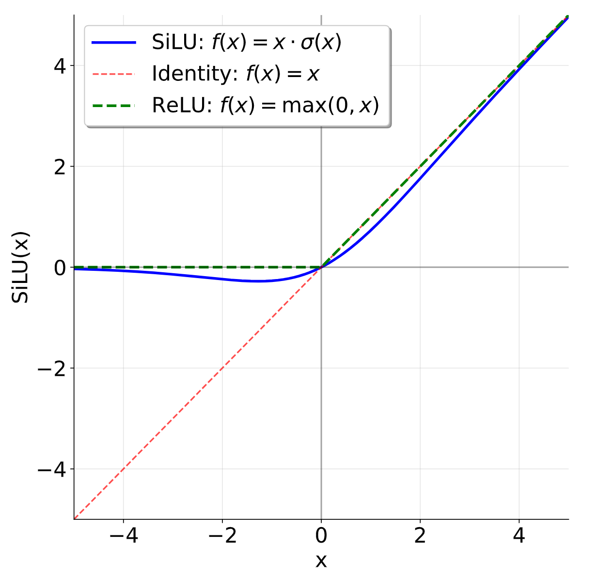

# Transformer Language Model Architecture

A language model takes as input a batched sequence of integer token IDs (i.e., `torch.Tensor` of shape `(batch_size, sequence_length)`), 
and returns a (batched) normalized probability distribution over the vocabulary (i.e., a PyTorch Tensor of shape `(batch_size, sequence_length, vocab_size)`), 
where the predicted distribution is over the next word for each input token. 
When training the language model, we use these next-word predictions to calculate the cross-entropy loss between the actual next word and the predicted next word. 
When generating text from the language model during inference, we take the predicted next-word distribution from the final time step (i.e., the last item in the sequence) 
to generate the next token in the sequence (e.g., by taking the token with the highest probability, sampling from the distribution, etc.), 
add the generated token to the input sequence, and repeat.

In week 2, you will build this Transformer language model from scratch.
We will begin with a high-level description of the model before progressively detailing the individual components.

## Transformer LM

Given a sequence of token IDs, the Transformer language model uses an input embedding to convert token IDs to dense vectors, 
passes the embedded tokens through num_layers of Transformer blocks, and then
applies a learned linear projection (the “output embedding” or “LM head”) to produce the predicted next-token logits. 
See Figure 1 for a schematic representation.

<figure align="center">
  
  <figcaption><b>Figure 1:</b> An overview of our Transformer language model.</figcaption>
</figure>


### Token Embeddings

In the very first step, the Transformer *embeds* the (batched) sequence of token IDs into a sequence of vectors containing information on the token identity (red blocks in Figure 1).

More specifically, given a sequence of token IDs, the Transformer language model uses a token embedding layer to produce a sequence of vectors. 
Each embedding layer takes in a tensor of integers of shape `(batch_size, sequence_length)` and produces a sequence of vectors of shape `(batch_size, sequence_length, d_model)`.

### Pre-norm Transformer Block

After embedding, the activations are processed by several **identically structured** neural net layers. 
A standard decoder-only Transformer language model consists of `num_layers` identical layers (commonly called Transformer “blocks”). 
Each Transformer block takes in an input of shape `(batch_size, sequence_length, d_model)` and returns an output of shape `(batch_size, sequence_length, d_model)`.
Each block aggregates information across the sequence (via self-attention) and non-linearly transforms it (via the feed-forward layers).

After `num_layers` Transformer blocks, we will take the final activations and turn them into a distribution over the vocabulary.

We will implement the "pre-norm" Transformer block (detailed later), which additionally requires the use of layer normalization (detailed later) after the final Transformer block to ensure its outputs are properly scaled.

After this normalization, we will use a standard learned linear transformation to convert the output of the Transformer blocks into predicted next-token logits (see, e.g., [A. Radford et al. [7] equation 2]).

## Remark: Batching, Einsum and Efficient Computation

Throughout the Transformer, we will be performing the same computation applied to many batch-like inputs. Here are a few examples:
- **Elements of a batch**: we apply the same Transformer forward operation on each batch element.
- **Sequence length**: the "position-wise" operations like RMSNorm and feed-forward operate identically on each position of a sequence.
- **Attention heads**: the attention operation is batched across attention heads in a "multi-headed" attention operation.

It is useful to have an ergonomic way of performing such operations in a way that fully utilizes the GPU, and is easy to read and understand. 
Many PyTorch operations can take in excess “batch-like” dimensions at the start of a tensor and repeat/broadcast the operation across these dimensions efficiently.

For instance, say we are doing a position-wise, batched operation. 
We have a "data tensor" $D$ of shape `(batch_size, sequence_length, d_model)`, and we would like to do a batched vector-matrix multiply against a matrix $A$ of shape `(d_model, d_model)`. 
In this case, `D @ A` will do a batched matrix multiply, which is an efficient primitive in PyTorch, where the `(batch_size, sequence_length)` dimensions are batched over.

Because of this, it is helpful to assume that your functions may be given additional batch-like dimensions and to keep those dimensions at the start of the PyTorch shape.
To organize tensors so they can be batched in this manner, they might need to be shaped using many steps of view, reshape and transpose.
This can be a bit of a pain, and it often gets hard to read what the code is doing and what the shapes of your tensors are.

A more ergonomic option is to use *einsum notation* within `torch.einsum`, or rather use framework-agnostic libraries like `einops` or `einx`. 
The two key ops are `einsum`, which can do tensor contractions with arbitrary dimensions of input tensors, and `rearrange`, which can reorder, concatenate, and split arbitrary dimensions. 
It turns out almost all operations in machine learning are some combination of dimension juggling and tensor contraction with the occasional (usually pointwise) nonlinear function. 
This means that a lot of your code can be more readable and flexible when using einsum notation.

We **strongly** recommend learning and using einsum notations. 
Students who have not been exposed to einsum notation before should use `einops` (docs [here](https://einops.rocks/1-einops-basics/)).
The packages are already installed in the environment we’ve supplied.

Here we give some examples of how einsum notation can be used. 
These are a supplement to the documentation for einops, which you should read first.

#### Example: Batched matrix multiplication with einops.einsum

```python
import torch
from einops import rearrange, einsum

## Basic implementation
Y = D @ A.T
# Hard to tell the input and output shapes and what they mean.
# What shapes can D and A have, and do any of these have unexpected behavior?

## Einsum is self-documenting and robust
#                          D                A     ->          Y
Y = einsum(D, A, "batch sequence d_in, d_out d_in -> batch sequence d_out")

## Or, a batched version where D can have any leading dimensions but A is constrained.
Y = einsum(D, A, "... d_in, d_out d_in -> ... d_out")
```

---

#### Example: Broadcasted operations with einops.rearrange

We have a batch of images, and for each image we want to generate 10 dimmed versions based on some scaling factor:

```python
images = torch.randn(64, 128, 128, 3) # (batch, height, width, channel)
dim_by = torch.linspace(start=0.0, end=1.0, steps=10)

## Reshape and multiply
dim_value = rearrange(dim_by,    "dim_value              -> 1 dim_value 1 1 1")
images_rearr = rearrange(images, "b height width channel -> b 1 height width channel")
dimmed_images = images_rearr * dim_value

## Or in one go:
dimmed_images = einsum(
    images, dim_by,
    "batch height width channel, dim_value -> batch dim_value height width channel"
)
```

---

#### Example: Pixel mixing with einops.rearrange

Suppose we have a batch of images represented as a tensor of shape `(batch, height, width, channel)`, and we want to perform a linear transformation across all pixels of the image, but this transformation should happen independently for each channel. 
Our linear transformation is represented as a matrix $B$ of shape `(height * width, height * width)`.

```python
channels_last = torch.randn(64, 32, 32, 3) # (batch, height, width, channel)
B = torch.randn(32*32, 32*32)

## Rearrange an image tensor for mixing across all pixels
channels_last_flat = channels_last.view(
    -1, channels_last.size(1) * channels_last.size(2), channels_last.size(3)
)
channels_first_flat = channels_last_flat.transpose(1, 2)
channels_first_flat_transformed = channels_first_flat @ B.T
channels_last_flat_transformed = channels_first_flat_transformed.transpose(1, 2)
channels_last_transformed = channels_last_flat_transformed.view(*channels_last.shape)
```

Instead, using `einops`:

```python
height = width = 32
## Rearrange replaces clunky torch view + transpose
channels_first = rearrange(
    channels_last,
    "batch height width channel -> batch channel (height width)"
)
channels_first_transformed = einsum(
    channels_first, B,
    "batch channel pixel_in, pixel_out pixel_in -> batch channel pixel_out"
)
channels_last_transformed = rearrange(
    channels_first_transformed,
    "batch channel (height width) -> batch height width channel",
    height=height, width=width
)
```

The first implementation here could be improved by placing comments before and after to indicate what the input and output shapes are, but this is clunky and susceptible to bugs. 
With einsum notation, documentation is implementation!

---

Einsum notation can handle arbitrary input batching dimensions, but also has the key benefit of being *self-documenting*. 
It’s much clearer what the relevant shapes of your input and output tensors are in code that uses einsum notation. 
For the remaining tensors, you can consider using Tensor type hints, for instance using the jaxtyping library (not specific to JAX).

---

### Mathematical Notation and Memory Ordering

Many machine learning papers use row vectors in their notation, which result in representations that mesh well with the row-major memory ordering used by default in NumPy and PyTorch. 
With row vectors, a linear transformation looks like
$$
y = x W^\top, \qquad (1)
$$

for row-major $W \in \mathbb{R}^{d_{\text{out} \times d_{\text{in}}}}$ and row-vector $x \in \mathbb{R}^{1 \times d_{\text{in}}}$. 
Notice that this lets us batch inputs by increasing the outermost dimension of $x$, meaning we can substitute vector input $x$ for matrix input $X \in \mathbb{R}^{\text{batch}\times d_{\text{in}}}$.

In linear algebra it’s generally more common to use column vectors, where linear transformations look like

$$
y = Wx, \qquad (2)
$$

given a row-major $W \in \mathbb{R}^{d_{\text{out}}\times d_{\text{in}}}$ and column-vector $x \in \mathbb{R}^{d_{\text{in}}}$. 
To batch the input in this setting, the batch dimension to $x$ would have to come last, so $x$ would need to be replaced with a matrix $\tilde X \in \mathbb{R}^{d_{\text{in}}\times \text{batch}}$.

**We will use mostly column vectors** for mathematical notation in this assignment, since math generally follows this notation. 
You should keep in mind that if you want to use plain matrix multiplication notation, you will have to apply matrices with a transpose as seen in the row vector convention in Equation $(1)$, since PyTorch uses row-major memory ordering. 
If you use `einsum` for your linear algebra operations, this should be a non-issue as long as you label your axes correctly. 
As an aside, it’s worth noting that other languages/linear algebra packages like Matlab, Julia and Fortran all use column-major memory ordering, 
meaning batching dimensions come last, but Python and related packages have adopted the C-standard of row-major ordering.


## Basic Building Blocks: Linear and Embedding Modules

> You should implement tihs part in week 1!

###  Parameter Initialization

Training neural networks effectively often requires careful initialization of the model parameters—bad initializations can lead to undesirable behavior such as vanishing or exploding gradients. 
Pre-norm transformers are unusually robust to initializations, but they can still have a significant impact on training speed and convergence.
For the sake of simplicity, we will save the details, and instead give you some approximate initializations that should work well for most cases.

For now, use:
- Linear weights: $\mathcal{N}\left( \mu=0, \sigma^2=\frac{2}{d_{\text{in}} + d_{\text{out}}} \right)$ truncated at $[-3\sigma, 3\sigma].$
- Embedding: $\mathcal{N}\left( \mu=0, \sigma^2=1 \right)$ truncated at $[−3, 3].$
- RMSNorm: $\mathbf{1}.$

You should use `torch.nn.init.trunc_normal_` to initialize the truncated normal weights.

---

### Linear Module

Linear layers are a fundamental building block of Transformers and neural nets in general. 
First, you will implement your own Linear class that inherits from `torch.nn.Module` and performs a linear transformation:

$$
y = Wx. \qquad (3)
$$

Note that we do **not** include a bias term, following most modern LLMs.

> Your implementation should be in `release/minillm/model/layers.py` (class Linear(nn.Module)).

---

### Embedding Module

As discussed above, the first layer of the Transformer is an embedding layer that maps integer token IDs into a vector space of dimension `d_model`. 
We will implement a custom `Embedding` class that inherits from `torch.nn.Module` (so you should not use `nn.Embedding`). 
The **forward** method should select the embedding vector for each token ID by indexing into an embedding matrix of shape `(vocab_size, d_model)` using a `torch.LongTensor` of token IDs with shape `(batch_size, sequence_length)`.

> Your implementation should be in `release/minillm/model/layers.py` (class Embedding(nn.Module)).


## Pre-Norm Transformer Block

Each Transformer block has two sub-layers: a multi-head self-attention mechanism and a position-wise feed-forward network ([A. Vaswani et al., 2017], section 3.1).

In the original Transformer paper, the model uses a residual connection around each of the two sub-layers, followed by layer normalization. 
This architecture is commonly known as the "post-norm" Transformer, since layer normalization is applied to the sub-layer output. 
However, a variety of work has found that moving layer normalization from the output of each sub-layer to the input of each sub-layer (with an additional layer normalization after the final Transformer block) improves Transformer training stability [T. Q. Nguyen et al., 2019; R. Xiong et al., 2020] — see Figure 2 for a visual representation of
this "pre-norm" Transformer block. 

<figure align="center">
  
  <figcaption><b>Figure 2:</b> A pre-norm Transformer block.</figcaption>
</figure>

The output of each Transformer block sub-layer is then added to the sub-layer input via the residual connection ([A. Vaswani et al. [8]], section 5.4). 
An intuition for pre-norm is that there is a clean "residual stream" without any normalization going from the input embeddings to the final output of the Transformer, which is purported to improve gradient flow. 
This pre-norm Transformer is now the standard used in language models today (e.g., GPT-3, LLaMA, PaLM, etc.), so we will implement this variant. 
We will walk through each of the components of a pre-norm Transformer block, implementing them in sequence.

###  Root Mean Square Layer Normalization

The original Transformer implementation of [A. Vaswani et al. [8]] uses layer normalization [J. L. Ba et al., 2016] to normalize activations. 
Following [H. Touvron et al. [12]], we will use root mean square layer normalization ([RMSNorm; B. Zhang et al. [13]], equation 4) for layer normalization. 
Given a vector $a \in \mathbb{R}^{d_{\text{model}}}$ of activations, `RMSNorm` will rescale each activation $a_i$ as follows:

$$
\text{RMSNorm}(a_i) = \frac{a_i}{RMS(a)}g_i,
$$

where $\text{RMS}(a) = \sqrt{\frac{1}{d_{\text{model}}} \sum_{i=1}^{d_{\text{model}}} a_i^2 + \varepsilon}.$
Here, $g_i$ is a learnable "gain" parameter (there are `d_model` such parameters total), and $\varepsilon$ is a hyperparameter that is often fixed at $1e-5$.

You should upcast your input to `torch.float32` to prevent overflow when you square the input. 
Overall, your `forward` method should look like:

```python
in_dtype = x.dtype
x = x.to(torch.float32)

# Your code here performing RMSNorm
...
result = ...

# Return the result in the original dtype
return result.to(in_dtype)
```

> Your implementation should be in `release/minillm/model/layers.py` (class RMSNorm(nn.Module)).

---

### Position-Wise Feed-Forward Network

<figure align="center">
  
  <figcaption><b>Figure 3:</b> Comparing the SiLU (aka Swish) and ReLU activation functions.</figcaption>
</figure>

In the original Transformer paper (section 3.3 of [A. Vaswani et al. [8]]), the Transformer feed-forward network consists of two linear transformations with a ReLU activation (ReLU(𝑥) = max(0, 𝑥)) between them. 
In that original architecture, the dimensionality of the inner feed-forward layer is typically $4x$ the input dimensionality.

However, modern language models tend to incorporate two main changes compared to this original design: 
they use another activation function and employ a gating mechanism.
Specifically, we will implement the "SwiGLU" activation function adopted in LLMs like Llama 3 [A. Grattafiori et al., 2024] and Qwen 2.5 [A. Yang et al., 2024], 
which combines the SiLU (often called Swish) activation with a gating mechanism called a Gated Linear Unit (GLU). 
We will also omit the bias terms sometimes used in linear layers, 
following most modern LLMs since PaLM [A. Chowdhery et al., 2022] and LLaMA [H. Touvron et al., 2023].

The SiLU or Swish activation function [D. Hendrycks et al., 2016; S. Elfwing et al., 2017] is defined as follows:
$$
\text{SiLU}(x) = x \cdot \sigma(x) = \frac{x}{1 + e^{-x}} \qquad (5)
$$

As can be seen in Figure 3, the SiLU activation function is similar to the ReLU activation function, but is smooth at zero.

Gated Linear Units (GLUs) were originally defined by [Y. N. Dauphin et al. [19]] as the element-wise product of a linear transformation passed through a sigmoid function and another linear transformation:

$$
\text{GLU}(x, W_1, W_2) = \sigma(W_1x) \odot W_2x, \qquad (6)
$$

where $\odot$ represents element-wise multiplication. 
Gated Linear Units are suggested to "reduce the vanishing gradient problem for deep architectures by providing a linear path for the gradients while retaining non-linear capabilities."


Putting the SiLU/Swish and GLU together, we get the SwiGLU, which we will use for our feed-forward networks:

$$
\text{FFN}(x) = \text{SwiGLU}(x, W_1, W_2, W_3) = W_2(SiLU(W_1x)\odot W_3x), \qquad (7)
$$

where $x \in \mathbb{R}^{d_{\text{model}}},$ $W_1, W_3 \in \mathbb{R}^{d_\text{ff} \times d_{\text{model}}},$ $W_2\in\mathbb{R}^{d_{\text{model}\times d_{\text{ff}}}},$ and canonically, $d_{\text{ff}} = \frac{8}{3}d_{\text{model}}.$ 
For concrete implementations, it is fine to round this to a nearby multiple of 64 for hardware efficiency.

[N. Shazeer [20]] first proposed combining the SiLU/Swish activation with GLUs and conducted experiments showing that SwiGLU outperforms baselines like ReLU and SiLU (without gating) on language modeling tasks. 
It's a good practice to compare SwiGLU and SiLU (but not demanded). 
Though we’ve mentioned some heuristic arguments for these components (and the papers provide more supporting evidence), 
it’s good to keep an empirical perspective: a now famous quote from Shazeer’s paper is

"We offer no explanation as to why these architectures seem to work; we attribute their success, as all else, to divine benevolence."

> Your implementation should be in `release/minillm/model/layers.py` (class SwiGLU(nn.Module)).

---

### Relative Positional Embeddings

To inject positional information into the model, we will implement Rotary Position Embeddings [J. Su et al., 2021], often called RoPE. 
For a given query token $q^{(i)} = W_q x^{(i)} \in \mathbb{R}^d$ at token position $i$, we will apply a pairwise rotation matrix $R^i$, giving us $q'^{(i)} = R^i q^{(i)} = R^i W_q x^{(i)}$. 
Here, $R^i$ will rotate pairs of embedding elements $q^{(i)}_{2k-1:2k}$ as 2d vectors by the angle $\theta_{i,k} = \frac{i}{\Theta^{(2k-2)/d}}$ for $k \in \{1, \ldots, d/2\}$ and some constant $\Theta$. Thus, we can consider $R^i$ to be a block-diagonal matrix of size $d \times d$, with blocks $R^i_k$ for $k \in \{1, \ldots, \frac{d}{2}\}$, with

$$
R^i_k =
\begin{pmatrix}
\cos(\theta_{i,k}) & -\sin(\theta_{i,k}) \\
\sin(\theta_{i,k}) & \cos(\theta_{i,k})
\end{pmatrix}
\qquad (8)
$$

Thus we get the full rotation matrix

$$
R^i =
\begin{pmatrix}
R^i_1 & 0 & 0 & \cdots & 0 \\
0 & R^i_2 & 0 & \cdots & 0 \\
0 & 0 & R^i_3 & \cdots & 0 \\
\vdots & \vdots & \vdots & \ddots & \vdots \\
0 & 0 & 0 & \cdots & R^i_{d/2}
\end{pmatrix},
\qquad (9)
$$

where 0s represent $2 \times 2$ zero matrices. While one could construct the full $d \times d$ matrix, a good solution should use the properties of this matrix to implement the transformation more efficiently. 
Since we only care about the relative rotation of tokens within a given sequence, we can reuse the values we compute for $\cos(\theta_{i,k})$ and $\sin(\theta_{i,k})$ across layers, and different batches. 
If you would like to optimize it, you may use a single RoPE module referenced by all layers, and it can have a 2d pre-computed buffer of sin and cos values created during init with `self.register_buffer(persistent=False)`, instead of an `nn.Parameter` because we do not want to learn these fixed cosine and sine values. 
The exact same rotation process we did for our $q^{(i)}$ is then done for $k^{(j)}$, rotating by the corresponding $R^j$. 
Notice that this layer has **no** learnable parameters.

> Your implementation should be in `release/minillm/model/layers.py` (class RotaryPositionalEmbedding(nn.Module)).

---

### Scaled Dot-Product Attention

We will now implement scaled dot-product attention as described in [A. Vaswani et al. [8]] (section 3.2.1). 
As a preliminary step, the definition of the Attention operation will make use of softmax, an operation that takes an unnormalized vector of scores and turns it into a normalized distribution:

$$
\mathrm{softmax}(v)_i = \frac{\exp(v_i)}{\sum_{j=1}^{n}\exp(v_j)}. \qquad (10)
$$

Note that $\exp(v_i)$ can become `inf` for large values (then, $\frac{\inf}{\inf} = \mathrm{NaN}$). 
We can avoid this by noticing that the softmax operation is invariant to adding any constant $c$ to all inputs. 
We can leverage this property for numerical stability—typically, we will subtract the largest entry of $v$ from all elements of $v$, making the new largest entry $0$. 
You will now implement softmax, using this trick for numerical stability.

> Your implementation should be in `release/minillm/model/layers.py` (def softmax).

We can now define the Attention operation mathematically as follows:

$$
\mathrm{Attention}(Q, K, V) = \mathrm{softmax}\left(\frac{QK^T}{\sqrt{d_k}}\right)V \qquad (11)
$$

where $Q \in \mathbb{R}^{n \times d_k}$, $K \in \mathbb{R}^{m \times d_k}$, and $V \in \mathbb{R}^{m \times d_v}$. 
Here, $Q$, $K$ and $V$ are all inputs to this operation—note that these are not the learnable parameters.

**Masking:** It is sometimes convenient to *mask* the output of an attention operation. 
A mask should have the shape $M \in \{\mathrm{True}, \mathrm{False}\}^{n \times m}$, and each row $i$ of this boolean matrix indicates which keys the query $i$ should attend to. 
Canonically (and slightly confusingly), a value of `True` at position $(i, j)$ indicates that the query $i$ *does* attend to the key $j$, and a value of `False` indicates that the query *does not* attend to the key. 
In other words, “information flows” at $(i, j)$ pairs with value `True`. 
For example, consider a $1 \times 3$ mask matrix with entries `[[True, True, False]]`. 
The single query vector attends only to the first two keys.

Computationally, it will be much more efficient to use masking than to compute attention on subsequences, and we can do this by taking the pre-softmax values $(QK^\top / \sqrt{d_k})$ and adding a $-\infty$ to any entry of the mask matrix that is `False`.

> Your implementation should be in `release/minillm/model/attention.py` (def scaled_dot_product_attention).
(You can do this in week2.)

---

### Causal Multi-Head Self-Attention

We will implement multi-head self-attention as described in section 3.2.2 of [A. Vaswani et al. [8]]. 
Recall that, mathematically, the operation of applying multi-head attention is defined as follows:

$$
\mathrm{MultiHead}(Q, K, V) = \mathrm{Concat}(\mathrm{head}_1, \ldots, \mathrm{head}_h) \qquad (12)
$$

$$
\text{for } \mathrm{head}_i = \mathrm{Attention}(Q_i, K_i, V_i) \qquad (13)
$$

with $Q_i$, $K_i$, $V_i$ being slice number $i \in \{1, \ldots, h\}$ of size $d_k$ or $d_v$ of the embedding dimension for $Q$, $K$, and $V$ respectively. 
With Attention being the scaled dot-product attention operation defined above. 
From this we can form the multi-head *self-attention* operation:

$$
\mathrm{MultiHeadSelfAttention}(x) = W_O \mathrm{MultiHead}(W_Q x, W_K x, W_V x) \qquad (14)
$$

Here, the learnable parameters are $W_Q \in \mathbb{R}^{h d_k \times d_{\mathrm{model}}}$, $W_K \in \mathbb{R}^{h d_k \times d_{\mathrm{model}}}$, $W_V \in \mathbb{R}^{h d_v \times d_{\mathrm{model}}}$, and $W_O \in \mathbb{R}^{d_{\mathrm{model}} \times h d_v}$. 
Since the $Q$s, $K$s, and $V$s are sliced in the multi-head attention operation, we can think of $W_Q$, $W_K$ and $W_V$ as being separated for each head along the output dimension. 
When you have this working, you should be computing the key, value, and query projections in a total of three matrix multiplies.

**Causal masking**

Your implementation should prevent the model from attending to future tokens in the sequence. 
In other words, if the model is given a token sequence $t_1, \ldots, t_n$, and we want to calculate the next-word predictions for the prefix $t_1, \ldots, t_i$ where $i < n$, 
the model should *not* be able to access attend to the token representations at positions $t_{i+1}, \ldots, t_n$ since it will not have access to these tokens when generating text during inference 
and these future tokens leak information about the identity of the true next word, trivializing the language modeling pre-training objective. 

For an input token sequence $t_1, \ldots, t_n$ we can naively prevent access to future tokens by running multi-head self-attention $n$ times for the $n$ unique prefixes in the sequence. 
Instead, we’ll use causal attention masking, which allows token $i$ to attend to all positions $j \leq i$ in the sequence. 
You can use `torch.triu` or a broadcasted index comparison to construct this mask, and you should take advantage of the fact that your scaled dot-product attention implementation already supports attention masking.

**Applying RoPE**

RoPE should be applied to the query and key vectors, but not the value vectors. 
Also, the head dimension should be handled as a batch dimension, because in multi-head attention, attention is being applied independently for each head. 
This means that precisely the same RoPE rotation should be applied to the query and key vectors for each head.

> Your implementation should be in `release/minillm/model/attention.py` (class MultiHeadSelfAttention(nn.Module)).
(You can do this in week2.)


## The Full Transformer LM

Let’s begin by assembling the Transformer block (it will be helpful to refer back to Figure 2). 
A Transformer block contains two ‘sub-layers’, one for the multihead self attention, and another for the SwiGLU feed-forward network. 
In each sub-layer, we first perform RMSNorm, then the main operation (MHA/FF), finally adding in the residual connection.

To be concrete, the first half (the first "sub-layer") of the Transformer block should be implementing the following set of updates to produce an output $y$ from an input $x$,

$$
y = x + \text{MultiHeadSelfAttention}(\text{RMSNorm}(x)). \qquad (15)
$$

Now you can implement the pre-norm Transformer block as illustrated in Figure 2.

> Your implementation should be in `release/minillm/model/transformer.py` (class TransformerBlock(nn.Module)).
(You can do this in week2.)

After you implement the Transformer block, we can put the blocks together, following the high-level diagram in Figure 1. 
Follow our description of the embedding, feed this into num_layers Transformer blocks, 
and then pass that into the final layer norm and LM head to obtain an unnormalized distribution over the vocabulary (the logits).

The logits path is the Transformer LM itself. 
You are also asked to support a training convenience interface in your `TransformerLM.forward`. The output contains both logits and a loss term.

After computing `logits`, if `labels` is provided, call:

```python
loss = cross_entropy(logits, labels, ignore_index=-100)
```

and return it as `out["loss"]`.

> Your implementation should be in `release/minillm/model/transformer.py` (class TransformerLM(nn.Module)).
(You can do this in week2.)
