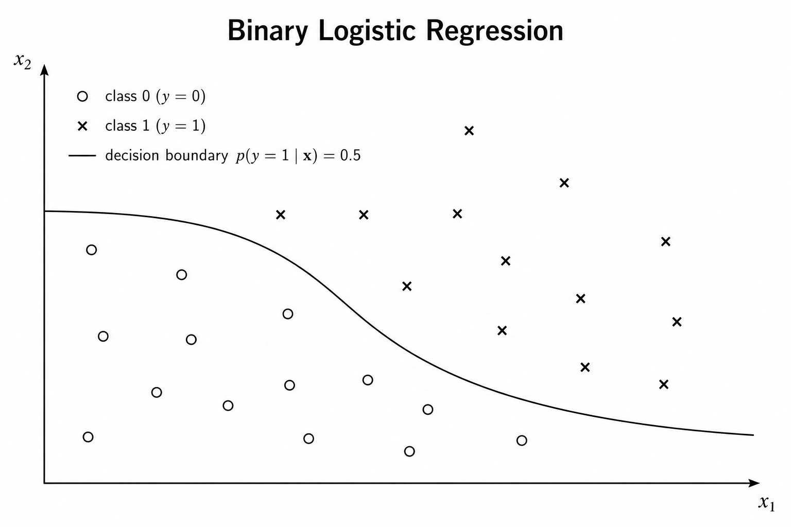
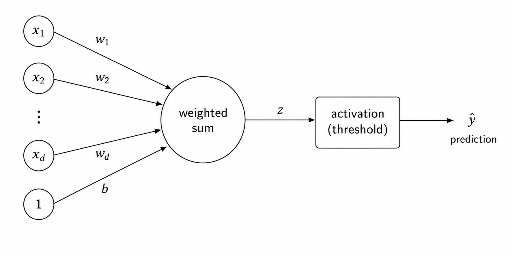
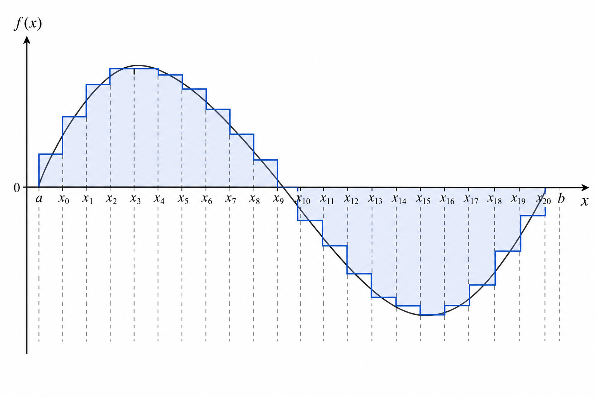
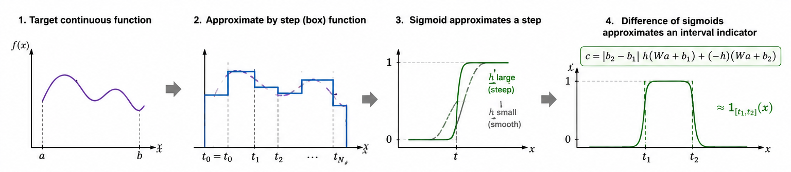
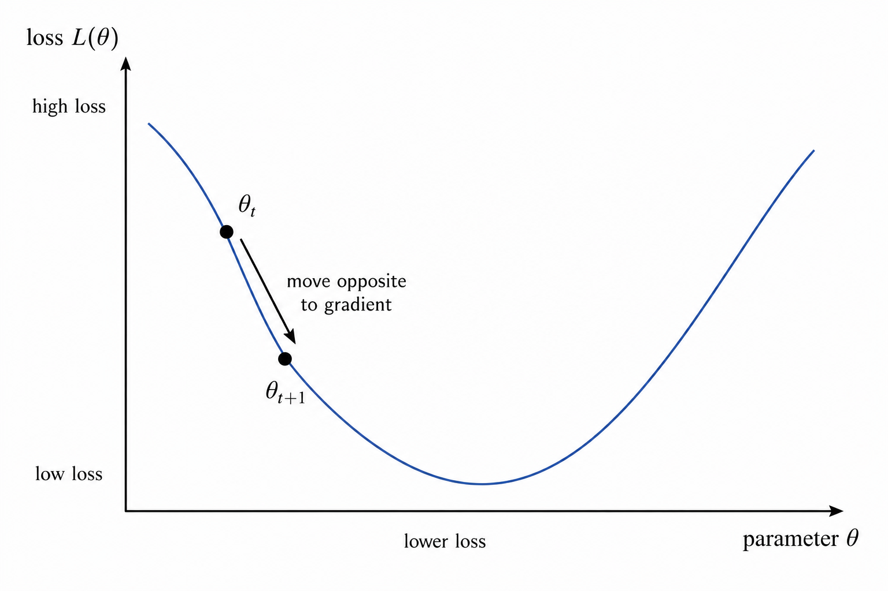

# Deep Learning Intro

*All models are wrong, but some are useful. — George E. P. Box*

This section gives a minimal mental model of deep learning.
The goal is to understand the basic components that appear again and again: **data, models, parameters, losses, optimization, and neural networks as function approximators**.
You will not know why modern language models work after reading this (actually no one knows).

Recommended public resources will also be included at the end.

A very brief summary:
> Deep learning trains a parametrized function \(f_\theta\) so that, on examples we care about, its outputs match the desired targets.
> Neural networks are useful because, with nonlinear layers and enough capacity, they can represent very complicated functions.
> And training is the process of searching for good parameters.


## AI, Machine Learning, and Deep Learning

A rough hierarchy is:

```text
Artificial Intelligence
└── Machine Learning
    └── Deep Learning
````

In classical programming, we write explicit rules. In machine learning, we instead provide examples and ask the system to learn a rule from data.
Deep learning uses a deep neural network to do machine learning.

Common learning settings:

| Setting                | Input                     | Goal                                        |
| ---------------------- | ------------------------- | ------------------------------------------- |
| Supervised learning    | labeled examples $x, y$ | learn to predict $y$ from $x$               |
| Unsupervised learning  | unlabeled data $x$        | discover structure or learn representations |
| Reinforcement learning | states, actions, rewards  | learn actions that maximize reward          |

Many other learning paradigms are variations of these three settings. 
For example, self-supervised learning can be viewed as unsupervised learning where the supervision is generated from the data itself.

Here's a brief introduction of the 3 learning settings.

### Supervised Learning

In **supervised learning**, the training data contains both inputs and desired outputs: $(x_1, y_1), (x_2, y_2), \ldots, (x_m, y_m).$

Here, $x_i$ is called the **feature** or input, and $y_i$ is called the **label** or target. The goal is to learn a function $f_\theta(x) \approx y.$

For example:
- image -> class label
- house features -> house price
- English sentence -> French sentence
- token sequence -> next token

Supervised learning includes regression, classification, sequence prediction, and many other tasks. In this project, language modeling can be viewed as a supervised-style problem: given previous tokens, predict the next token.

---

### Unsupervised Learning

In **unsupervised learning**, the data does **not** come with explicit labels. We only observe inputs: $x_1, x_2, \ldots, x_m.$

The goal is not to predict a given label, but to discover useful structure in the data.

For example:
- grouping similar data points
- finding low-dimensional representations
- learning embeddings
- modeling the probability distribution of data
- generating new samples

A related idea is **self-supervised learning**. Here, the data is still unlabeled, but we create a training signal from the data itself.
For example, in text, we can hide part of a sentence and train the model to predict the missing words, or train a language model to predict the next token.

---

### Reinforcement Learning

In **reinforcement learning**, the learner is an **agent** that interacts with an **environment**.

At each step, an agent observes states (roughly a subset of the environment), then the agent chooses action, then the environment returns reward, then the environment changes, ...

The goal is to learn a **policy** $\pi(\text{observation}) = \text{action},$ so that the agent receives high long-term reward.

For example:
- game-playing agents
- robots learning to move
- agents learning from human or automatic feedback

Unlike supervised learning, the agent is usually not told the correct action for every situation. It only receives rewards, sometimes delayed, so it must figure out which actions helped or hurt. This makes reinforcement learning powerful but also more complicated than the supervised learning setup used in most of this project.

>Most of this project uses supervised or self-supervised learning style, i.e. input tokens -> model -> predicted next token.
> For language modeling, the “label” is usually the next token in the text.


## The Basic Learning Setup

> There are five basic components in a learning setup: **dataset**, **model**, **loss function**, **training**, and **test**. We illustrate them with two simple supervised learning examples: linear regression and logistic regression.

> *Deep learning keeps the same pipeline, but replaces the linear model with a much richer neural network $f_\theta$.*

Given a labeled dataset

$$
S = \{(\mathbf{x}_i, y_i)\}_{i=1}^m,
$$

a learning problem usually follows the same pattern:

$$
\text{choose a model class } \mathcal{F}
\quad \longrightarrow \quad
\text{define a loss } L_S(f)
\quad \longrightarrow \quad
f^* = \arg\min_{f \in \mathcal{F}} L_S(f).
$$

After training, we evaluate the learned model on unseen examples. Ideally, examples come from an unknown data distribution $\mathcal{D}$:

$$
(\mathbf{x}, y) \sim \mathcal{D}.
$$

The ideal test performance is

$$
\mathrm{Eval}(f^*)
=
\mathbb{E}_{(\mathbf{x}, y) \sim \mathcal{D}}
\left[
\ell(f^*(\mathbf{x}), y)
\right].
$$

In practice, we approximate this expectation using a held-out test set. A model is useful only if it performs well not only on the training set, but also on unseen data. This is called **generalization**.

---

### Linear regression

Linear regression is used when the label is a real number.

Given a **labeled dataset** $S = {(\mathbf{x}_i, y_i)}_{i=1}^m,\; \mathbf{x}_i \in \mathbb{R}^d,\ y_i \in \mathbb{R},$

we choose a **model class** $\mathcal{F}\left\{f_{\mathbf{w}, b}(\mathbf{x})\mathbf{w}^{\top}\mathbf{x} + b : \mathbf{w} \in \mathbb{R}^d,\ b \in \mathbb{R}\right\}.$
Here, $\mathbf{w}$ and $b$ are the learnable parameters.

To measure prediction error, we use a **loss function**. 
For linear regression, a standard loss is squared loss: $\ell(f_{\mathbf{w}, b}; \mathbf{x}_i, y_i)=\left(f_{\mathbf{w}, b}(\mathbf{x}_i) - y_i\right)^2.$

The empirical loss is $L_S(\mathbf{w}, b)=\frac{1}{m}\sum_{i=1}^{m}\left(\mathbf{w}^{\top}\mathbf{x}_i + b - y_i\right)^2.$

Training means solving $(\mathbf{w}^*, b^*)=\arg\min_{\mathbf{w}, b}L_S(\mathbf{w}, b).$

So linear regression learns a function whose predictions are close to real-valued labels.

---

### Logistic Regression

Logistic regression is used for binary classification.   
Now the label is a class: $\mathbf{x}_i \in \mathbb{R}^d,\;y_i \in \{-1, +1\}.$

<figure align="center">
  
  <figcaption><b>Figure 1:</b> Logistic regression.</figcaption>
</figure>

We still start with a linear score: $z=f_{\mathbf{w}, b}(\mathbf{x})=\mathbf{w}^{\top}\mathbf{x} + b.$

Equivalently, we can absorb the bias into the feature vector:
$\mathbf{x}' =\begin{bmatrix}1 \\ \mathbf{x}\end{bmatrix},\;\mathbf{w}' =\begin{bmatrix}b \\ \mathbf{w}\end{bmatrix},\; z = \langle \mathbf{x}', \mathbf{w}' \rangle.$

For classification, the output should be a probability, not an arbitrary real number. So we pass the score through the sigmoid function: $\sigma(z)=\frac{1}{1 + \exp(-z)}.$

We interpret $q(y = +1 \mid \mathbf{x}) = \sigma(z),\;q(y = -1 \mid \mathbf{x}) = 1 - \sigma(z) = \sigma(-z)$ where $q(\cdot)$ is a probability function.

If $q(y = +1 \mid \mathbf{x}) \geq q(y = -1 \mid \mathbf{x}),$ the predicted label is $+1.$ Otherwise the predicted label is $-1.$

Equivalently, the predicted label is $\hat{y}=\begin{cases}+1, & \sigma(z) \geq \frac{1}{2}, \\ -1, & \text{otherwise}.\end{cases}$

Since $\sigma(z) \geq \frac{1}{2}$ exactly when $z \geq 0$, the decision boundary is

$$
\mathbf{w}^{\top}\mathbf{x} + b = 0.
$$

So logistic regression is still a linear classifier. The sigmoid turns the linear score into a probability.

> What is a proper loss function for this problem?

In classification, the true label can be viewed as a probability distribution $p$ over classes. For example, $p(y = +1) = 1,\ p(y = -1) = 0$ if the true label is $+1.$

The model also outputs a probability distribution $q$: $q(y = +1 \mid \mathbf{x}) = \sigma(z),\;q(y = -1 \mid \mathbf{x}) = 1 - \sigma(z).$

So we need a loss that compares two distributions. 

A standard choice is **cross-entropy**: $\mathrm{CE}(p, q)=-\sum_y p(y)\log q(y) = H(p) + \mathrm{KL}(p \| q).$ (check entropy and KL divergence here.)

Since $H(p)$ does not depend on the model, minimizing cross-entropy encourages $q$ to be close to the true distribution $p$.

For binary logistic regression with $y \in \{-1, +1\}$, the cross-entropy loss becomes $\ell(f; \mathbf{x}, y)=\log\left(1 + \exp(-y f(\mathbf{x}))\right).$

Thus the empirical loss is $L_S(\mathbf{w}, b)=\frac{1}{m}\sum_{i=1}^{m}\log\left(1 + \exp\left(-y_i(\mathbf{w}^{\top}\mathbf{x}_i + b)\right)\right).$

Training means solving $(\mathbf{w}^*, b^*)=\arg\min_{\mathbf{w}, b}L_S(\mathbf{w}, b).$

The structure is the same as linear regression:

$$
\text{dataset} \to \text{model} \to \text{prediction} \to \text{loss} \to \text{training}.
$$

The difference is the meaning of the output and the choice of loss.

---

For multi-class classification, we use **softmax** instead of sigmoid.

Given logits $\mathbf{z} = (z_1, \ldots, z_c) \in \mathbb{R}^c$, softmax produces a probability distribution: $\mathrm{softmax}(\mathbf{z})_j = \frac{\exp(z_j / T)}{\sum_{k=1}^c \exp(z_k / T)}$.

Softmax has two useful properties:

1. every output is nonnegative;
2. the outputs sum to 1.

So softmax turns arbitrary scores into a probability distribution.

Here $T > 0$ is a temperature parameter. Smaller $T$ makes the distribution sharper; larger $T$ makes it smoother. 

As $T \to 0$, softmax approaches a one-hot distribution concentrated on the largest logit, similar to taking an argmax. As $T \to \infty$, softmax approaches the uniform distribution over classes. Cross-entropy is then used to compare the predicted distribution with the one-hot true label.


## Perceptron

A perceptron is the simplest neural unit. It takes several input features, computes a weighted sum, adds a bias, and then applies a nonlinear threshold to produce a prediction.

<figure align="center">
  
  <figcaption><b>Figure 2:</b> Perceptron.</figcaption>
</figure>


Mathematically, given an input $\mathbf{x} = (x_1, \ldots, x_d)$, the perceptron first computes a score $z = \mathbf{w}^{\top}\mathbf{x} + b$. 
Here, $\mathbf{w}$ contains the weights, and $b$ is the bias term.

Then it applies a hard threshold, such as $\hat{y} = \mathrm{sign}(z)$. 
For binary classification, this means $\hat{y} = +1$ if $z \geq 0$, and $\hat{y} = -1$ otherwise.

The perceptron is closely related to logistic regression. Both start from the same linear score $z = \mathbf{w}^{\top}\mathbf{x} + b$. 
The difference is that logistic regression outputs a probability $\sigma(z)$, while the perceptron outputs a hard label directly.

The perceptron is important because it already contains several ideas that appear in neural networks: 
weighted sum of inputs, bias term, nonlinear threshold, prediction, and parameter update from mistakes.

A single perceptron can only represent linear decision boundaries. 
Neural networks become more powerful by stacking many such units with nonlinear activations.

## Activation Functions

The perceptron already contains the core pattern of a neural network unit: compute a weighted sum $z = \mathbf{w}^{\top}\mathbf{x} + b$, then apply a nonlinear function $y = \sigma(z)$. This nonlinear function $\sigma$ is called an **activation function**.

Why do we need activation functions? If we only stack linear layers, the result is still linear. For example, if $h = W_1x + b_1$ and $o = W_2h + b_2$, then $o = W_2(W_1x + b_1) + b_2 = (W_2W_1)x + (W_2b_1 + b_2)$. So no matter how many linear layers we stack, we still get one linear transformation.

Activation functions break this collapse. A neural network layer usually has the form $h = \sigma(Wx + b)$. Because $\sigma$ is nonlinear, stacking many such layers can represent much richer functions.

Here are some common activation functions.

| Activation | Formula | Shape / intuition |
|---|---|---|
| Sigmoid | $\sigma(x) = \frac{1}{1+\exp(-x)}$ | smooth step from $0$ to $1$ |
| Tanh | $\tanh(x)$ | smooth step from $-1$ to $1$ |
| ReLU | $\mathrm{ReLU}(x) = \max(0, x)$ | zero for negative inputs, linear for positive inputs |
| Leaky ReLU | $\mathrm{LeakyReLU}(x)=\max(\alpha x, x)$ | like ReLU, but keeps a small negative slope |
| ELU | $\mathrm{ELU}(x)=x$ if $x\ge 0$, and $\alpha(\exp(x)-1)$ if $x<0$ | smooth negative part, linear positive part |
| SiLU / Swish | $\mathrm{SiLU}(x)=x\sigma(x)$ | smooth gated ReLU-like activation |

Sigmoid and tanh are smooth, but they can suffer from **vanishing gradients**. For sigmoid, $\sigma'(x)=\sigma(x)(1-\sigma(x))$, so when $x$ is very large or very negative, $\sigma'(x)$ is close to $0$. In a deep network, many small gradients are multiplied together during backpropagation (introduce later), which can make earlier layers learn very slowly.

ReLU helps because its gradient is $1$ when $x>0$. However, ReLU has zero gradient when $x<0$, so some units may stop updating if they stay negative. Leaky ReLU and ELU keep a small or smooth negative-side gradient to reduce this issue.

Modern Transformer MLPs often use **gated activations**. A gate means that one part of the network controls how much information passes through another part. A simple gated form is $\mathrm{GLU}(a,b)=a\odot\sigma(b)$, where $\odot$ is elementwise multiplication. In many language models, a common variant is **SwiGLU**, roughly $\mathrm{SwiGLU}(x) = (xW_1) \odot \mathrm{SiLU}(xW_3)$, followed by another linear projection.

Intuitively, activations and gates let the model decide not only *what features to compute*, but also *which features to pass forward*. This is one reason neural networks are much more expressive than a single linear model.

## Neural Networks as a Model Class

With perceptrons and activation functions, we can now define a neural network. A feedforward neural network is a composition of affine maps and nonlinear activations. For example, a two-layer network has the form $h=\sigma(W_1x+b_1)$ and $f_\theta(x)=W_2h+b_2$, where $\theta=\{W_1,b_1,W_2,b_2\}$ contains all learnable parameters.

More generally, for depth $L$, we can write $h_0=x$, $h_\ell=\sigma(W_\ell h_{\ell-1}+b_\ell)$ for $\ell=1,\ldots,L-1$, and $f_\theta(x)=W_Lh_{L-1}+b_L$. Thus a neural network defines a model class $\mathcal{F}_{\mathrm{NN}}=\{f_\theta:\theta \text{ is a valid choice of weights and biases}\}$.

So compared with linear regression, the learning setup is unchanged: we still choose a model class $\mathcal{F}$, define a loss $L_S(f)$, and train $f^*=\arg\min_{f\in\mathcal{F}}L_S(f)$. The difference is that $\mathcal{F}_{\mathrm{NN}}$ is much richer than the class of linear functions.

A particularly important example is the one-hidden-layer network $f(x)=\sum_{j=1}^m a_j\sigma(w_j^\top x+b_j)+c$. Here $m$ is the width of the hidden layer. The classical universal approximation theorem says that, for suitable nonlinear activation functions such as sigmoid, a one-hidden-layer network with sufficiently large width can approximate any continuous function on a compact domain arbitrarily well [Cybenko 1989; Hornik et al. 1989].

The proof idea is not very mysterious. A continuous function on a compact interval can first be approximated by a step-like or box-like function. A sigmoid with a large slope can approximate a step function. Differences of shifted sigmoids can approximate interval indicators. By adding many such local pieces together, a shallow neural network can approximate the target function.

<figure align="center">
  
  <figcaption><b>Figure 3:</b> Step function illustration.</figcaption>
</figure>

<figure align="center">
  
  <figcaption><b>Figure 4:</b> GPT generated approximation illustration based on my notes.</figcaption>
</figure>

For ReLU networks, the intuition is similar but more geometric. ReLU is piecewise linear, so ReLU networks build piecewise-linear approximations. With enough units, they can approximate complicated curves or surfaces by many small linear pieces. More refined results show that even width-bounded ReLU networks can be universal approximators: for input dimension $d$, width $d+4$ is enough to approximate Lebesgue-integrable functions in an $L^1$ sense, if arbitrary depth is allowed [Lu et al. 2017].

Depth also matters. Some functions can be represented efficiently by deep networks but would require exponentially many units if we tried to represent them with much shallower networks [Telgarsky 2016]. This is one reason we care not only about the number of neurons, but also about the network architecture.

The main takeaway is:

> Neural networks form a flexible model class. With nonlinear activations, enough width, and/or enough depth, they can approximate very rich families of functions.

But this theorem should not be overinterpreted. Universal approximation says that good parameters exist. It does not say that gradient descent will find them, that the model will generalize, or that larger language models work for the same simple reason. For this project, the theorem only gives us a useful intuition: neural networks are expressive enough to be plausible function approximators, and training is the process of searching for useful parameters inside this large model class.

## Training Neural Networks

Now we have a powerful model class: neural networks. But a model class alone is not enough. We still need to answer the training question:

How do we choose better parameters $\theta$?

For a neural network $f_\theta$, training means minimizing the empirical loss $L_S(\theta)$. The parameters $\theta$ include all weights and biases in the network.

### Gradient Descent

The key idea is to view the loss as a function of the parameters: $L_S(\theta)$. If the current parameters are $\theta_t$, the gradient $\nabla_\theta L_S(\theta_t)$ points in the direction where the loss increases fastest. Therefore, to reduce the loss, we move in the opposite direction:

$\theta_{t+1} = \theta_t - \eta \nabla_\theta L_S(\theta_t)$.

Here $\eta > 0$ is the **learning rate**. It controls the step size.

<figure align="center">
  
  <figcaption><b>Figure 5:</b> Gradient descent.</figcaption>
</figure>

If $\eta$ is too small, training is slow. If $\eta$ is too large, the update may overshoot and training can become unstable. In practice, choosing a good learning rate is one of the most important parts of training.

### SGD and Mini-batch SGD

The full training loss is $L_S(\theta) = \frac{1}{m}\sum_{i=1}^m \ell(f_\theta(x_i), y_i)$. Computing its exact gradient uses the whole dataset, which can be expensive.

**Stochastic gradient descent** uses one example, or a small subset of examples, to estimate the gradient. In practice, we usually use **mini-batch SGD**: choose a mini-batch $B \subset S$ and compute $L_B(\theta) = \frac{1}{|B|}\sum_{(x_i,y_i)\in B}\ell(f_\theta(x_i), y_i)$, then update $\theta \leftarrow \theta - \eta \nabla_\theta L_B(\theta)$.

Mini-batches make training much faster and work well on GPUs, because many examples can be processed in parallel.

### Backpropagation

To update parameters, we need gradients such as $\frac{\partial L}{\partial W}$ and $\frac{\partial L}{\partial b}$ for every layer. A neural network is a composition of many operations, so these gradients are computed using the chain rule. This procedure is called **backpropagation**.

A forward pass computes predictions and loss:

```text
input x -> layer 1 -> layer 2 -> ... -> output -> loss
```

A backward pass propagates gradient information in the reverse direction:

```text
loss gradient -> output -> ... -> layer 2 -> layer 1 -> parameters
```

Backpropagation is efficient because it reuses intermediate values from the forward pass and applies the chain rule systematically. Instead of trying to test each parameter separately, backprop computes useful gradients for all parameters in one backward pass.

This is why neural networks can be trained even when they have millions or billions of parameters: the gradients are computed automatically and efficiently.

### What Is an Optimizer?

An optimizer is **not** the choice of loss function.

The **loss function** defines what we want to minimize. For example, squared loss or cross-entropy tells us what “bad prediction” means.

The **optimizer** defines how we update the parameters to reduce the loss. Gradient descent and SGD are optimizers. More advanced optimizers, such as Adam and AdamW, modify the update rule using running statistics of gradients.

So the training setup separates two questions:

1. Objective: what loss are we minimizing?
2. Optimizer: how do we update parameters to reduce that loss?

### What We Need to Choose During Training

When training a neural network, we must choose several things carefully:

- the loss function, such as squared loss or cross-entropy;
- the optimizer, such as SGD, Adam, or AdamW;
- the learning rate $\eta$;
- the batch size;
- the number of training steps or epochs;
- the model architecture and initialization;
- evaluation on held-out data to check generalization.

In this project, you are not asked to find out the best choice of these hyperparameters.

## Generalization

A model can fit the training data but still fail on new data. This is called poor generalization.

We usually track two losses: training loss and validation / test loss. If training loss is low but validation loss is high, the model may be overfitting.

In simple terms: training loss tells us whether the model fits examples it saw; validation loss tells us whether the learned pattern transfers to held-out examples.

For language modeling, a lower validation loss usually means the model is better at predicting unseen text from the same distribution.


## Recommended Materials

You can check out these resources based on what interests you.

Besides deep learning:

- **Python Engineer: PyTorch Tutorial 02 - Tensor Basics**  
  Video: https://www.youtube.com/watch?v=exaWOE8jvy8  
  Web notes: https://www.python-engineer.com/courses/pytorchbeginner/02-tensor-basics/

We recommend this video as a short introduction to the concept and basic usage of PyTorch tensors. It covers tensor creation, common tensor operations, and conversion between NumPy arrays and PyTorch tensors. 
Tensors will be used frequently in the Week 2 tasks, so you should be comfortable with their shapes, dtypes, and basic operations before starting that part of the project.

Introduction of `einops` is covered in [Transformer LM.md](./Transformer%20LM.md) section 2.

### Deep Learning Basics

- **Dive into Deep Learning (D2L)**, Aston Zhang, Zachary C. Lipton, Mu Li, and Alexander J. Smola.  
  Website: https://d2l.ai/  
  Recommended sections:
  - Introduction to machine learning and deep learning;
  - linear regression;
  - softmax regression;
  - multilayer perceptrons;
  - backpropagation and automatic differentiation;
  - optimization algorithms.

- **3Blue1Brown Neural Networks Playlist**, Grant Sanderson.  
  Playlist: https://www.youtube.com/playlist?list=PLZHQObOWTQDNU6R1_67000Dx_ZCJB-3pi  
  Recommended videos:
  - *But what is a neural network?*
  - *Gradient descent, how neural networks learn*
  - *What is backpropagation really doing?*
  - *Backpropagation calculus*

These videos are especially useful for geometric intuition: what neurons compute, why gradients point in useful directions, and how backpropagation propagates error signals backward through a network.

### Backpropagation

For a first intuitive explanation, watch the 3Blue1Brown backpropagation videos. For a more implementation-oriented treatment, read the backpropagation and automatic differentiation sections in D2L.

Classical references:

- David E. Rumelhart, Geoffrey E. Hinton, and Ronald J. Williams. **Learning representations by back-propagating errors.** *Nature*, 1986.  
  URL: https://www.nature.com/articles/323533a0

- Paul J. Werbos. **Beyond Regression: New Tools for Prediction and Analysis in the Behavioral Sciences.** PhD thesis, Harvard University, 1974.  
  This is an early work connecting chain-rule-based gradient computation to learning systems.

- Seppo Linnainmaa. **The representation of the cumulative rounding error of an algorithm as a Taylor expansion of the local rounding errors.** Master’s thesis, University of Helsinki, 1970.  
  This is an early foundation of reverse-mode automatic differentiation.

### Universal Approximation and Expressivity

The universal approximation theorem gives one reason neural networks are plausible function approximators: under suitable conditions, neural networks can approximate very broad classes of functions. This does **not** fully explain why modern large language models work, but it gives useful mathematical intuition for why neural networks are expressive model classes.

Classical and related references:

- George Cybenko. **Approximation by superpositions of a sigmoidal function.** *Mathematics of Control, Signals and Systems*, 1989.  
  This is a classical universal approximation result for sigmoidal activation functions.

- Kurt Hornik, Maxwell Stinchcombe, and Halbert White. **Multilayer feedforward networks are universal approximators.** *Neural Networks*, 1989.  
  This is another classical result showing that multilayer feedforward networks can approximate broad classes of functions.

- Moshe Leshno, Vladimir Ya. Lin, Allan Pinkus, and Shimon Schocken. **Multilayer feedforward networks with a nonpolynomial activation function can approximate any function.** *Neural Networks*, 1993.  
  This result gives a more precise condition on activation functions: non-polynomial activations are sufficient for universal approximation.

- Zhou Lu, Hongming Pu, Feicheng Wang, Zhiqiang Hu, and Liwei Wang. **The Expressive Power of Neural Networks: A View from the Width.** NeurIPS, 2017.  
  URL: https://arxiv.org/abs/1709.02540  
  This paper studies how the width of ReLU networks affects expressivity.

- Matus Telgarsky. **Benefits of depth in neural networks.** COLT, 2016.  
  URL: https://arxiv.org/abs/1602.04485  
  This paper gives theoretical examples where deeper networks can represent some functions much more efficiently than shallower networks.

## References

- Zhang, A., Lipton, Z. C., Li, M., and Smola, A. J. **Dive into Deep Learning.** https://d2l.ai/
- Sanderson, G. **3Blue1Brown Neural Networks Playlist.** https://www.youtube.com/playlist?list=PLZHQObOWTQDNU6R1_67000Dx_ZCJB-3pi
- Rumelhart, D. E., Hinton, G. E., and Williams, R. J. **Learning representations by back-propagating errors.** *Nature*, 1986.
- Werbos, P. J. **Beyond Regression: New Tools for Prediction and Analysis in the Behavioral Sciences.** PhD thesis, Harvard University, 1974.
- Linnainmaa, S. **The representation of the cumulative rounding error of an algorithm as a Taylor expansion of the local rounding errors.** Master’s thesis, University of Helsinki, 1970.
- Cybenko, G. **Approximation by superpositions of a sigmoidal function.** *Mathematics of Control, Signals and Systems*, 1989.
- Hornik, K., Stinchcombe, M., and White, H. **Multilayer feedforward networks are universal approximators.** *Neural Networks*, 1989.
- Leshno, M., Lin, V. Y., Pinkus, A., and Schocken, S. **Multilayer feedforward networks with a nonpolynomial activation function can approximate any function.** *Neural Networks*, 1993.
- Lu, Z., Pu, H., Wang, F., Hu, Z., and Wang, L. **The Expressive Power of Neural Networks: A View from the Width.** NeurIPS, 2017.
- Telgarsky, M. **Benefits of depth in neural networks.** COLT, 2016.